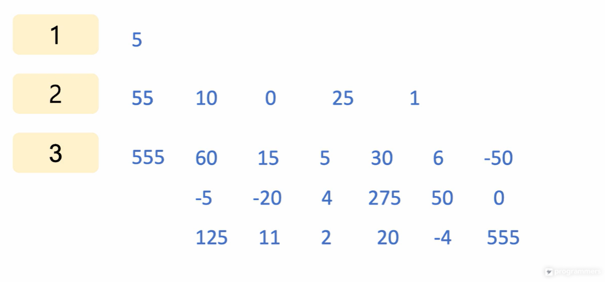
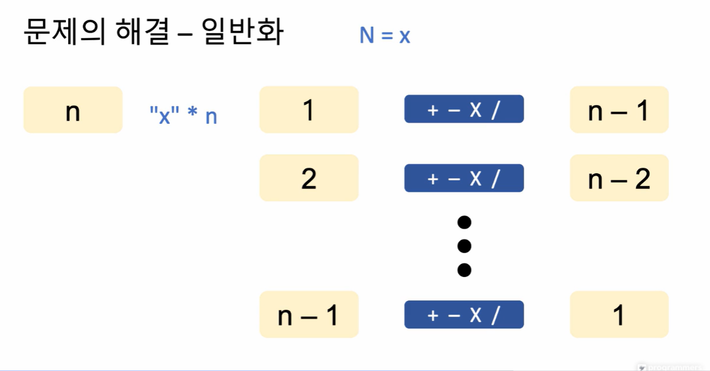

# 지문 이해 및 풀이 계획 세우기
## 동적계획법(Dynamic Programming)
주어진 최적화 문제를 재귀적인 방식으로 보다 작은 문제로 나누어 부분 문제를 풀어,이 해를 조합하여 전체 문제의 해답에 이르는 방식

알고리즘의 진행에 따라 **탐색해야 할 범위를 동적으로 결정**함으로써 탐색 범위를 한정할 수 있음

## 동저계획법의 적용 예
### 피보나치 수열
#### 재귀함수로 구현
f(4) = f(3)                +f(2)

f(4) = f(2)        +f(1)   +f(1) +f(0)  

f(4) = f(1) + f(0) +(f1)   +f(1) +f(0)

#### 동적계획법을 적용
f(0) = 0

f(1) = 1

f(2) = f(1) + f(0) = 1

f(3) = f(2) + f(1) = 2

복잡도 : 선형함수의 형태

## 문제의 해결 - 예제
N = 5

1. 1번 사용한 경우
   5
2. 2번 사용한 경우
   55 => + | - | x | / => 10 | 0 | 25 | 1
   3. 3번 사용한 경우
   555 => (1번 사용한 수)에 (2번 사용한 수)를 + | - | x | /
   혹은 => (2번 사용한 수)에 (1번 사용한 수)를 + | - | x | / 
   

## 문제의 해결 - 일반화

## 요약
문제의 성질에 따라, 동적계획법으로 풀어냄으로써 탐색해야하는 범위를 효과적으로 줄일 수 있음
